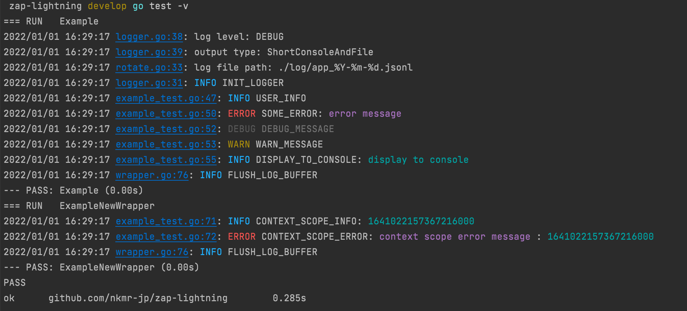

Refactoring for the release of v1.0

# Zap Lightning

Zap Lightning is a lightweight wrapper for [zap](https://github.com/uber-go/zap).<br>
It provides presets for easy implementation of advanced logging features.

## How it works

```sh
go test -v
```

### Simple log to console


### Json structured log to file

```shell
cat log/app_2022-01-01.jsonl
```

```json lines
{"level":"INFO","ts":"2022-01-01T16:29:17.366451+09:00","caller":"https://github.com/nkmr-jp/zap-lightning/blob/v0.1.1/zl/logger.go#L31","function":"github.com/nkmr-jp/zap-lightning/zl.InitLogger.func1","msg":"INIT_LOGGER","version":"v0.1.1","hostname":"nkmrnoMacBook-Pro.local"}
{"level":"INFO","ts":"2022-01-01T16:29:17.366869+09:00","caller":"https://github.com/nkmr-jp/zap-lightning/blob/v0.1.1/example_test.go#L47","function":"github.com/nkmr-jp/zap-lightning_test.Example","msg":"USER_INFO","version":"v0.1.1","hostname":"nkmrnoMacBook-Pro.local","name":"Alice","age":20}
{"level":"ERROR","ts":"2022-01-01T16:29:17.366917+09:00","caller":"https://github.com/nkmr-jp/zap-lightning/blob/v0.1.1/example_test.go#L50","function":"github.com/nkmr-jp/zap-lightning_test.Example","msg":"SOME_ERROR","version":"v0.1.1","hostname":"nkmrnoMacBook-Pro.local","error":"error message","stacktrace":"github.com/nkmr-jp/zap-lightning_test.Example\n\t/Users/nkmr/ghq/github.com/nkmr-jp/zap-lightning/example_test.go:50\ntesting.runExample\n\t/Users/nkmr/.anyenv/envs/goenv/versions/1.17.5/src/testing/run_example.go:64\ntesting.runExamples\n\t/Users/nkmr/.anyenv/envs/goenv/versions/1.17.5/src/testing/example.go:44\ntesting.(*M).Run\n\t/Users/nkmr/.anyenv/envs/goenv/versions/1.17.5/src/testing/testing.go:1505\nmain.main\n\t_testmain.go:45\nruntime.main\n\t/Users/nkmr/.anyenv/envs/goenv/versions/1.17.5/src/runtime/proc.go:255"}
{"level":"DEBUG","ts":"2022-01-01T16:29:17.36699+09:00","caller":"https://github.com/nkmr-jp/zap-lightning/blob/v0.1.1/example_test.go#L52","function":"github.com/nkmr-jp/zap-lightning_test.Example","msg":"DEBUG_MESSAGE","version":"v0.1.1","hostname":"nkmrnoMacBook-Pro.local"}
{"level":"WARN","ts":"2022-01-01T16:29:17.367017+09:00","caller":"https://github.com/nkmr-jp/zap-lightning/blob/v0.1.1/example_test.go#L53","function":"github.com/nkmr-jp/zap-lightning_test.Example","msg":"WARN_MESSAGE","version":"v0.1.1","hostname":"nkmrnoMacBook-Pro.local"}
{"level":"INFO","ts":"2022-01-01T16:29:17.367045+09:00","caller":"https://github.com/nkmr-jp/zap-lightning/blob/v0.1.1/example_test.go#L55","function":"github.com/nkmr-jp/zap-lightning_test.Example","msg":"DISPLAY_TO_CONSOLE","version":"v0.1.1","hostname":"nkmrnoMacBook-Pro.local","console":"display to console"}
{"level":"INFO","ts":"2022-01-01T16:29:17.36707+09:00","caller":"https://github.com/nkmr-jp/zap-lightning/blob/v0.1.1/zl/wrapper.go#L76","function":"github.com/nkmr-jp/zap-lightning/zl.Sync","msg":"FLUSH_LOG_BUFFER","version":"v0.1.1","hostname":"nkmrnoMacBook-Pro.local"}
{"level":"INFO","ts":"2022-01-01T16:29:17.367266+09:00","caller":"https://github.com/nkmr-jp/zap-lightning/blob/v0.1.1/example_test.go#L71","function":"github.com/nkmr-jp/zap-lightning_test.ExampleNewWrapper","msg":"CONTEXT_SCOPE_INFO","version":"v0.1.1","hostname":"nkmrnoMacBook-Pro.local","user_id":1,"trace_id":1641022157367216000}
{"level":"ERROR","ts":"2022-01-01T16:29:17.36734+09:00","caller":"https://github.com/nkmr-jp/zap-lightning/blob/v0.1.1/example_test.go#L72","function":"github.com/nkmr-jp/zap-lightning_test.ExampleNewWrapper","msg":"CONTEXT_SCOPE_ERROR","version":"v0.1.1","hostname":"nkmrnoMacBook-Pro.local","error":"context scope error message","user_id":1,"trace_id":1641022157367216000,"stacktrace":"github.com/nkmr-jp/zap-lightning_test.ExampleNewWrapper\n\t/Users/nkmr/ghq/github.com/nkmr-jp/zap-lightning/example_test.go:72\ntesting.runExample\n\t/Users/nkmr/.anyenv/envs/goenv/versions/1.17.5/src/testing/run_example.go:64\ntesting.runExamples\n\t/Users/nkmr/.anyenv/envs/goenv/versions/1.17.5/src/testing/example.go:44\ntesting.(*M).Run\n\t/Users/nkmr/.anyenv/envs/goenv/versions/1.17.5/src/testing/testing.go:1505\nmain.main\n\t_testmain.go:45\nruntime.main\n\t/Users/nkmr/.anyenv/envs/goenv/versions/1.17.5/src/runtime/proc.go:255"}
{"level":"INFO","ts":"2022-01-01T16:29:17.367387+09:00","caller":"https://github.com/nkmr-jp/zap-lightning/blob/v0.1.1/zl/wrapper.go#L76","function":"github.com/nkmr-jp/zap-lightning/zl.Sync","msg":"FLUSH_LOG_BUFFER","version":"v0.1.1","hostname":"nkmrnoMacBook-Pro.local"}
```

## Install

```sh
go get -u github.com/nkmr-jp/zap-lightning/zl
```

```sh
# If you want to use the latest feature.
go get -u github.com/nkmr-jp/zap-lightning/zl@develop
```

## Usage

See: [example_test.go](example_test.go)

## Features
- Json structured log to file.
- Simple log to console.
- Stack trace when error.
- Log file rotation.
- Write Code Version and Host to log.
- Write Caller URL to log.
- Context logging.
- etc...
